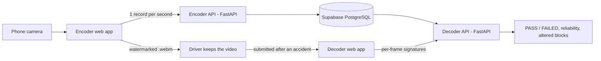

# Cloud-Based Video Fingerprint Collection System

A proof-of-concept **Edge-to-Cloud dashcam integrity system** for an insurance scenario.
A driver's dashcam records the road and sends a small fingerprint of one frame per second to the cloud.
After an accident, the insurer uploads the video the driver submitted, and the system tells whether it was modified
(blurred, covered by a sticker, cut, or replaced) by comparing it with the fingerprints recorded while driving.

> Course project, Master of Software Engineering and Digital Transformation, Cloud Computing module.
> Author: Fazalhaq Zaland

## Why not just hash the video?

A SHA-256 hash changes completely if a single bit changes. The Encoder sees the raw camera image, but the insurer only
receives a **compressed** video, so an exact hash of the pixels would never match, even for an untouched video.
This project therefore fingerprints what a frame *looks like*, with a tolerance, and uses SHA-256 to protect the stored records.

## How it works



**Encoder (driver side)**
- Draws the camera on a canvas and records it with `MediaRecorder` (WebM).
- Burns a **frame-index barcode** (16-bit index + CRC-8) into the top of every frame.
- Once per second computes a **content signature**: the frame is split into an 8 x 8 grid, and each block stores its mean brightness and its edge detail (blur lowers detail, covering changes brightness).
- Stores `SHA-256(driver | session | frame index | timestamp | signature)` with the record.
- Keeps records in an **offline queue** (localStorage) when the network drops, and sends them later in order. Retries are safe because the database has a unique key on (driver, session, frame index).

**Decoder (insurer side)**
- Plays the submitted video, reads the barcode of each frame, recomputes the signature, and compares it block by block with the trusted cloud record (matched by frame index, not by position).
- Reports `CONTENT_ALTERED` (with the changed blocks, e.g. `r3c4`), `MISSING_FRAME`, `UNEXPECTED_FRAME` and `CLOUD_RECORD_INCONSISTENT` (a stored record that fails its SHA-256 check), plus a reliability percentage.
- Three sensitivity profiles: **strict** (0 altered blocks allowed), **normal** (1), **lenient** (3).
- A purge button deletes records older than two hours.

## Project structure

```
.
|-- migration.sql          # database changes for an existing table
|-- encoder/               # driver-side app (FastAPI + browser UI)
|   |-- main.py
|   |-- config.py          # loads SUPABASE_URL / SUPABASE_KEY from .env
|   |-- requirements.txt
|   `-- static/index.html
|-- decoder/               # insurer-side app (FastAPI + browser UI)
|   |-- main.py
|   |-- config.py
|   |-- requirements.txt
|   |-- core/integrity_validator.py
|   `-- static/index.html
`-- evaluation/            # distance-metric and threshold evaluation
    |-- evaluate.py
    |-- make_synthetic.py
    `-- requirements.txt
```

## Setup

**Requirements:** Python 3.10+, a free [Supabase](https://supabase.com) project, a webcam or phone camera,
and a recent Chrome, Edge or Safari (the Decoder needs `requestVideoFrameCallback`).
The camera only works on `localhost` or over HTTPS.

### 1. Create the database table

In the Supabase SQL editor, for a **new** project:

```sql
create table if not exists fingerprints (
  id                 bigint generated always as identity primary key,
  driver_id          text not null,
  session_id         text,
  frame_index        integer not null,
  fingerprint_hash   text not null,
  recorded_timestamp timestamptz default now(),
  captured_at        text,
  signature          text,
  received_at        timestamptz default now()
);
create unique index if not exists fingerprints_frame_uniq
  on fingerprints (driver_id, session_id, frame_index);
```

If you already have an older `fingerprints` table, run `migration.sql` instead. It **deletes all existing rows** and adds the new columns.

### 2. Configure credentials

Create a `.env` file in both `encoder/` and `decoder/`:

```
SUPABASE_URL=https://YOUR_PROJECT_ID.supabase.co
SUPABASE_KEY=YOUR_KEY
```

**Never commit `.env`.** Add it to `.gitignore`. The key stays on the server and is never sent to the browser.

### 3. Install dependencies

```bash
python -m venv .venv
source .venv/bin/activate        # Windows: .venv\Scripts\activate
pip install -r encoder/requirements.txt
```

## Run

```bash
# Terminal 1 - Encoder
cd encoder
uvicorn main:app --port 8001 --reload

# Terminal 2 - Decoder
cd decoder
uvicorn main:app --port 8000 --reload
```

1. Open **http://127.0.0.1:8001**, click *Enable Camera*, enter a Driver ID, click *Start Recording*, record at least 20 seconds, then *Stop & Download*.
2. Open **http://127.0.0.1:8000**, enter the same Driver ID and click *Fetch Cloud Records*.
3. Choose the downloaded video, set sensitivity to **strict** and playback to **1x**, and click *Verify Integrity*.
4. Edit a copy of the video (add a sticker, blur a region, cut the end) and verify it again to see it rejected.

The first fingerprint is taken about 2 seconds after recording starts, because the recorder's opening moments are unstable.

## API

| Method | Endpoint | Purpose |
|---|---|---|
| POST | `/api/transmit` (Encoder) | Receive and store one signed frame record |
| GET | `/api/audit/{driver_id}` (Decoder) | Latest session and number of trusted frames |
| POST | `/api/verify-video` (Decoder) | Compare submitted frame signatures with the cloud |
| DELETE | `/api/cleanup` (Decoder) | Delete records older than two hours |

## Evaluation of distance metrics and thresholds

The `evaluation/` folder compares several fingerprint distances on genuine (re-encoded, rescaled, slightly brighter or darker, noisy),
tampered (stickers, blur) and impostor (other second of the same video) frames, and picks a threshold for each metric.

```bash
cd evaluation
pip install -r requirements.txt      # ffmpeg must also be installed
python evaluate.py dashcam_evidence.webm --out results
```

Results on one recording (22 frames, thresholds chosen by balanced accuracy):

| Metric | AUC | Genuine accepted | Tampered accepted |
|---|---|---|---|
| Signature, block rule (strict) | 0.66 | 66.7% | **0.0%** |
| Signature, Euclidean (L2) | 0.81 | 66.7% | **0.0%** |
| Signature, cosine | 0.94 | 99.2% | 26.1% |
| pHash, Hamming | 0.85 | 68.2% | 23.9% |
| wHash, Hamming | 0.80 | 98.5% | 63.6% |
| dHash, Hamming | 0.72 | 100% | 88.6% |
| aHash, Hamming | 0.72 | 64.4% | 48.9% |
| ssdeep | 0.50 | 100% | 100% |

- Distances on the block-wise signature were the only ones that rejected every tampered frame.
- Hamming distance on 64-bit perceptual hashes was not reliable for local edits such as a sticker or a blurred region.
- ssdeep found no similarity between any pair, so it is not useful for video frames. TLSH was not measured in this run.
- Limits: one recording, and the thresholds were chosen and measured on the same data.

## Limitations

This is a proof of concept, not a production dashcam product.

- One fingerprint per second: an edit shorter than about a second that avoids the sampled frames could go undetected.
- With an 8 x 8 grid, a very small overlay changes a block only slightly and may stay within the tolerance.
- The signature uses brightness and detail only, so a colour-only change with the same brightness can be missed.
- Records are protected by a SHA-256 chain, **not** by a digital signature. Anyone with database access could recompute valid hashes. A real system would sign each record with a key held in the phone's secure hardware.
- Not a deepfake detector. Permissive CORS and a single service key are used for the demo; production would need authentication, row-level security and HTTPS.
- The two-hour retention is a demo setting, not an insurance retention policy.

## Tech stack

HTML5 canvas, `getUserMedia`, `MediaRecorder`, Web Crypto API, Python, FastAPI, Uvicorn, Supabase (PostgreSQL).
Evaluation: FFmpeg, OpenCV, NumPy, pandas, Matplotlib, imagehash, ppdeep.
